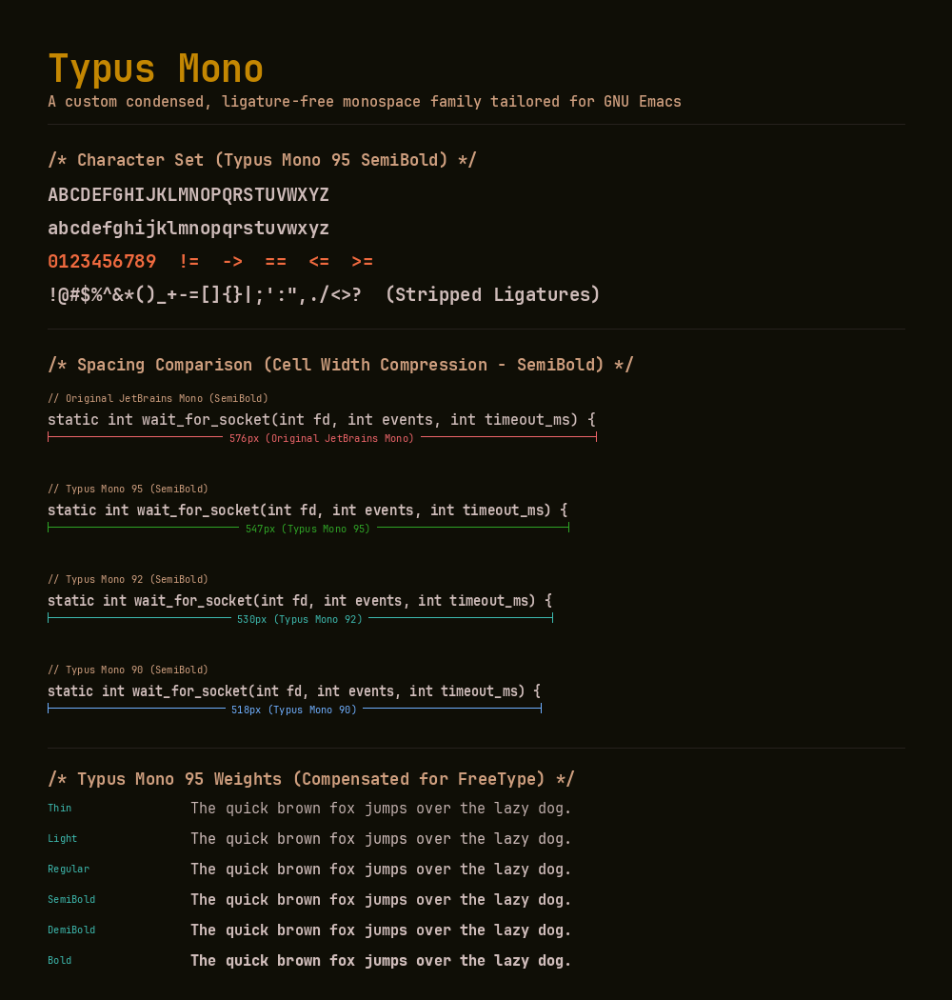
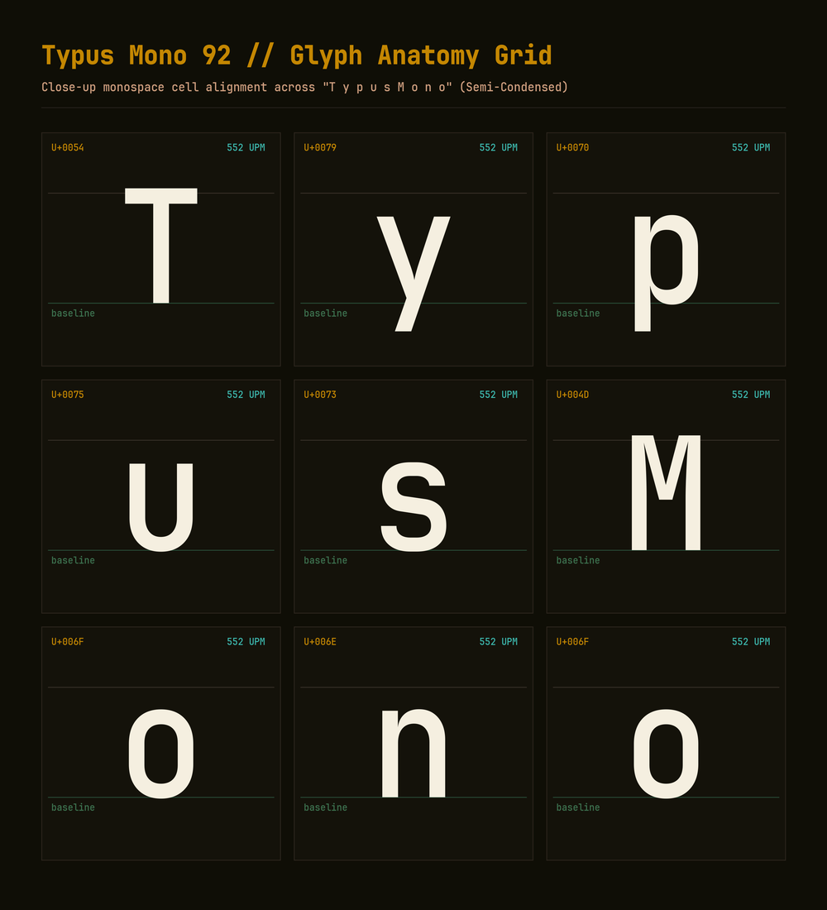

# Typus Mono

**Typus Mono** is a custom-compiled, condensed, and strictly ligature-free programming font family derived from **JetBrains Mono Nerd Font**. 

It serves as my personal daily driver. I maintain this repository as a central, easily accessible storage for my setups, though others who share my exact aesthetic preferences and layout constraints may find it useful.

<p align="center">
  
  
</p>

## Motivation

My journey with terminal aesthetics reached its peak with a highly tuned configuration in the Ghostty terminal emulator. By using cell compression (`adjust-cell-width = -1` and `adjust-cell-height = 1` at a size of `12pt`), I achieved a compact, high-information-density monospace grid that felt incredibly crisp to my eyes.

However, when using **GNU Emacs** I faced a `major` obstacle. While terminal emulators can dynamically pack cells tighter by shifting rendering coordinates, Emacs GUI relies on the font's native metrics. It has no built-in mechanism for sub-pixel character width compression *yet (maybe someday?)*.

To dissolve this mismatch and bring the exact, beloved Ghostty text layout into Emacs GUI, the modifications had to be baked directly into the font files. Thus, **Typus Mono** was born.

## Engineering Details

To achieve a pixel-perfect layout duplicate without ruining legibility, the customization relies on two key modifications:

### 1. Proportional Outline & Metrics Compression (90%, 92%, and 95% Widths)
To faithfully mirror Ghostty's cell compression (`adjust-cell-width = -1`), I've proportionally scaled glyph outlines and advance metrics down to **90%**, **92%**, or **95%**.

Each glyph's bounding box and sidebearings (`LSB` and `RSB`) are dynamically recalculated and centered, guaranteeing perfectly balanced letter margins and zero optical distortion across all font sizes.

### 2. Shifted Weight Mapping (Compensating for FreeType)
When comparing GUI Emacs with Ghostty, my eyes immediately noticed a weight discrepancy. GPU-accelerated terminal renderers (such as Ghostty's custom shaders) naturally draw text with slightly more visual weight ("density"). Emacs GUI, using standard FreeType rasterization on Linux, renders the exact same font files noticeably thinner.

To correct this and restore visual parity, the font files were shifted up by weight classes:
- **Typus Mono `Regular`** is built from original **`SemiBold`**.
- **Typus Mono `SemiBold`** is built from original **`Bold`**.
- **Typus Mono `Bold`** is built from original **`ExtraBold`**.
- **Typus Mono `Light`** is built from original **`Regular`**.
- **Typus Mono `Thin`** is built from original **`Light`**.

This weight compensation, combined with the metrics scaling, yields a **1:1 pixel-perfect match** between Ghostty and Emacs GUI (measuring exactly **574 pixels for 64 characters** at size 12 with the 95 spacing variant).

### 3. Strict Ligature Stripping
Contextual alternates (`calt`), standard ligatures (`liga`), discretionary ligatures (`dlig`), and contextual ligatures (`clig`) are disabled directly inside the OpenType `GSUB` table. I don't really like them and this guarantees a clean, distraction-free environment without programming ligatures across all applications.

### 4. Grid-Aligned TrueType Autohinting (`ttfautohint`)
When scaling font outlines down, stale TrueType bytecode instructions from the original 100% width font can conflict with the scaled geometry. Typus Mono strips out-of-sync bytecode and uses `ttfautohint` with calibrated stem width calculation (`--stem-width-mode=qsq`) to generate fresh hinting instructions aligned with the condensed grid.

### 5. OpenType 1.9 & Typography Standards Compliance
- **`USE_TYPO_METRICS` (OS/2 `fsSelection` Bit 7)**: Enabled to enforce consistent, pixel-accurate line-height calculations across all operating systems.
- **`usWidthClass`**: Correctly classified as `3` (Condensed) for the 90 variant and `4` (Semi-Condensed) for the 92 and 95 variants.
- **`gasp` Table**: Includes full symmetric grayscale smoothing and grid-fitting flags (`0x000F`).
- **Contour Winding Normalization**: Validated to adhere to the TrueType standard (outer contours clockwise, inner cutouts counter-clockwise).

## Included Styles

Each scaling factor (90, 92, and 95) has its own independent family containing 12 styles:

- **Typus Mono 90**: `TypusMono90-Thin.ttf`, `TypusMono90-ThinItalic.ttf`, `TypusMono90-Light.ttf`, `TypusMono90-LightItalic.ttf`, `TypusMono90-Regular.ttf`, `TypusMono90-Italic.ttf`, `TypusMono90-SemiBold.ttf`, `TypusMono90-SemiBoldItalic.ttf`, `TypusMono90-Demibold.ttf`, `TypusMono90-DemiboldItalic.ttf`, `TypusMono90-Bold.ttf`, `TypusMono90-BoldItalic.ttf`
- **Typus Mono 92**: `TypusMono92-Thin.ttf`, `TypusMono92-ThinItalic.ttf`, `TypusMono92-Light.ttf`, `TypusMono92-LightItalic.ttf`, `TypusMono92-Regular.ttf`, `TypusMono92-Italic.ttf`, `TypusMono92-SemiBold.ttf`, `TypusMono92-SemiBoldItalic.ttf`, `TypusMono92-Demibold.ttf`, `TypusMono92-DemiboldItalic.ttf`, `TypusMono92-Bold.ttf`, `TypusMono92-BoldItalic.ttf`
- **Typus Mono 95**: `TypusMono95-Thin.ttf`, `TypusMono95-ThinItalic.ttf`, `TypusMono95-Light.ttf`, `TypusMono95-LightItalic.ttf`, `TypusMono95-Regular.ttf`, `TypusMono95-Italic.ttf`, `TypusMono95-SemiBold.ttf`, `TypusMono95-SemiBoldItalic.ttf`, `TypusMono95-Demibold.ttf`, `TypusMono95-DemiboldItalic.ttf`, `TypusMono95-Bold.ttf`, `TypusMono95-BoldItalic.ttf`

## Building from Source

The repository contains the exact tools used to build this font family. Requires Python 3, `fonttools`, and `ttfautohint`:

```bash
# Searches standard paths for source JetBrainsMono Nerd Font files and builds all variants
./build.sh
```

You can pass a custom source directory path if needed:
```bash
./build.sh /path/to/source/jetbrains-mono-nerd-font/directory
```

## Installation

```bash
mkdir -p ~/.local/share/fonts/TypusMono
cp fonts/*.ttf ~/.local/share/fonts/TypusMono/
fc-cache -fv
```

To load one of the families (e.g., Typus Mono 95) in Emacs GUI:
```elisp
(set-frame-font "Typus Mono 95-12:weight=normal" nil t)
```

## License & Credits

Typus Mono is licensed under the **SIL Open Font License, Version 1.1** (OFL). 

- Derived from [JetBrains Mono](https://www.jetbrains.com/lp/mono/) (Copyright (c) 2020, JetBrains).
- Nerd Font glyphs integrated from [Nerd Fonts](https://github.com/ryanoasis/nerd-fonts).
